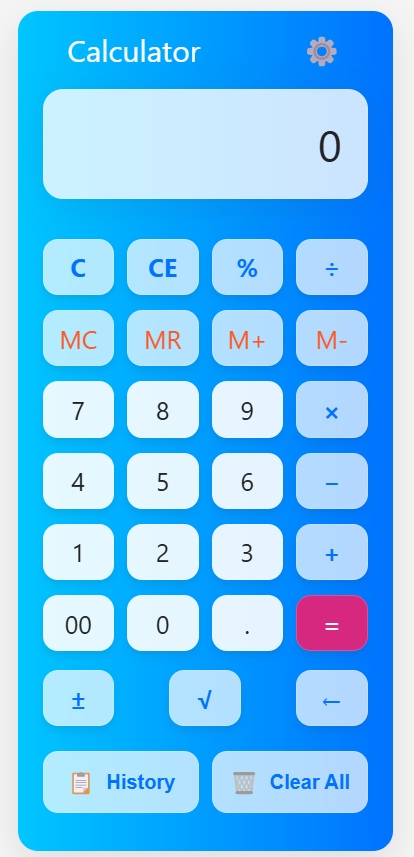
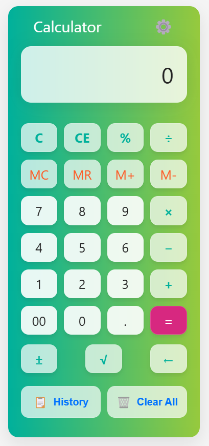
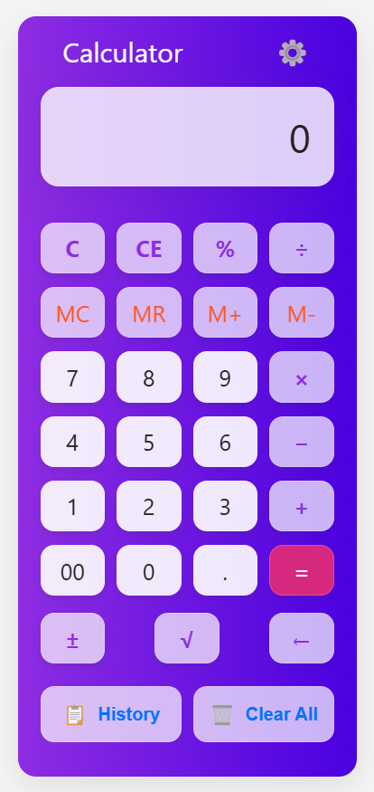
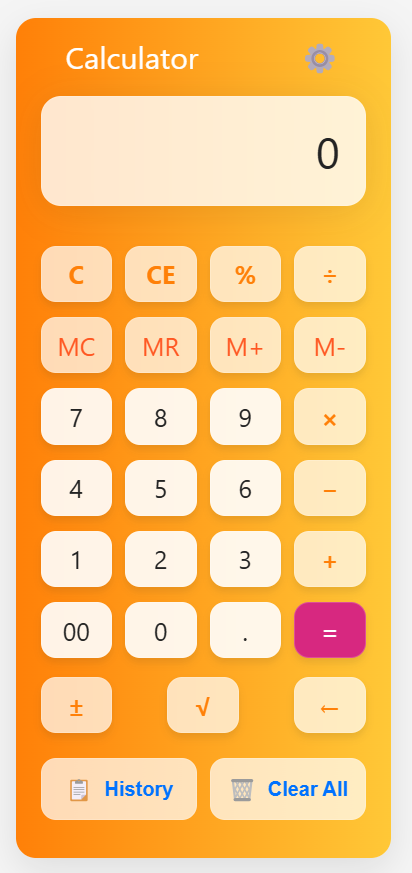

# 🧮 Advanced Calculator

A modern, feature-rich calculator web application with a **clean UI, customizable themes, and accessibility features**.

<p align="center">
  
  
  
  
</p>

---

## ✨ Features

### ✅ Basic & Advanced Operations

- Perform standard arithmetic operations (**+, -, ×, ÷**)
- Advanced functions like **square root (√) and modulo (%)**

### 🏗 Memory Functions

- **M+**: Add to memory
- **M-**: Subtract from memory
- **MR**: Recall stored value
- **MC**: Clear memory

### 📜 Calculation History

- View previous calculations
- Click on history items to reuse results
- **Clear History** button to reset all

### 🎨 Customizable Themes

- **5 Color Themes**: Blue, Green, Purple, Orange, High Contrast
- **Dark Mode Support**

### 🎛 Multiple Input Methods

- **Touch/mouse support**
- **Full keyboard support**

### 🛠 Accessibility Features

- **ARIA labels** for screen readers
- **Keyboard navigation**
- **High contrast mode** for visibility
- **Screen reader friendly design**

### 📱 Responsive Design

- Works seamlessly across **mobile, tablet, and desktop**
- **Special landscape mode** for mobile devices

### 🎯 Enhanced User Experience

- **Smooth button click animations**
- **Optional sound feedback**
- **Optional haptic feedback** (for supported devices)

### 🔄 Settings Persistence

- Saves **user preferences** between sessions

---

## 🛠 Technologies Used

- **HTML5**
- **CSS3** (animations & responsive design)
- **Vanilla JavaScript** (no frameworks)
- **LocalStorage API** for settings and history persistence

---

## 🚀 Getting Started

### Prerequisites

- A modern web browser (**Chrome, Firefox, Safari, Edge**)

### Installation

1. **Clone the repository:**
   ```bash
   git clone https://github.com/your-repo/advanced-calculator.git
   ```
2. **Open `index.html` in your browser**
   - Or use a local development server (e.g., Live Server in VS Code)

---

## 🎮 Usage Guide

### ➕ Basic Operations

- Click number buttons to input values
- Use **+, −, ×, ÷** for calculations
- Press **=** to compute
- Press **C** to clear all or **CE** to clear the current entry

### 🧠 Memory Functions

- **M+**: Add current value to memory
- **M-**: Subtract from memory
- **MR**: Recall stored memory
- **MC**: Clear memory

### 🏆 Advanced Functions

- **%**: Modulo operation
- **√**: Square root calculation
- **±**: Toggle positive/negative values
- **←**: Remove last digit

### 📜 History Panel

- Click **"History"** to view past calculations
- Click a history item to **reuse the result**
- Use **"Clear History"** to reset history

### ⚙ Settings Panel

- Click the **gear icon (⚙️)** to open settings
- Toggle **Dark Mode**
- Select a **color theme**
- Enable/disable **sound and haptic feedback**

---

## ⌨ Keyboard Shortcuts

- **Numbers 0-9**: Input numbers
- **+ , - , \* , /**: Basic operations
- **%**: Modulo operation
- **Enter**: Calculate (=)
- **Escape**: Clear all (C)
- **Backspace**: Delete last digit (←)
- **m**: Memory recall (MR)
- **M**: Memory add (M+)
- **n**: Memory subtract (M-)
- **c**: Memory clear (MC)

<!-- ---

## 🌍 Browser Compatibility

✅ Tested and working on:

- **Chrome 90+**
- **Firefox 88+**
- **Safari 14+**
- **Edge 90+**

---

## 🤝 Contributing

Want to contribute? Follow these steps:

1. **Fork the repository**
2. **Create a feature branch** (`git checkout -b feature/new-feature`)
3. **Commit your changes** (`git commit -m 'Add new feature'`)
4. **Push to GitHub** (`git push origin feature/new-feature`)
5. **Open a Pull Request** 🎉

---

## 📜 License

This project is licensed under the **MIT License** - see the LICENSE file for details.

---

## 🙏 Acknowledgments

- **Icons & sounds** used are royalty-free
- Special thanks to **[your acknowledgments here]** -->
